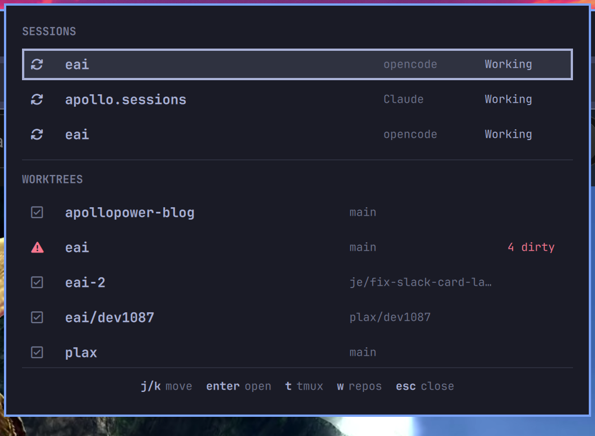

# Agent Cockpit

An Omarchy bar widget for people who run several coding agents at once. It
tells you which ones are actually waiting on you, and jumps you straight to the
right tmux pane.



The bar carries a single `>_` icon that sits quietly at the same weight as your
other status icons, and shifts to your theme's urgent colour when an agent is
blocked. No counters, nothing appearing or disappearing.

## Install

```bash
omarchy plugin add https://github.com/apollopower/omarchy-agent-cockpit --enable
```

## Keys

| Key | Action |
| --- | --- |
| `j` / `k` | move the selection |
| `Enter` | on a session, focus its exact tmux pane; on a worktree, open it in a terminal |
| `t` | focus the tmux terminal, opening a new window for a worktree |
| `w` | collapse the worktree list to one row per repository, and back |
| `Tab` | switch to the neighbouring bar panel |
| `Esc` | close |

## Configuration

Settings go **inline on the widget's entry** in `~/.config/omarchy/shell.json`,
alongside `id` — not nested under a `settings` key, which is silently ignored:

```json
{
  "id": "apollo.agent-cockpit",
  "worktreeRoots": "~/code:~/Work/repos",
  "showLinkedWorktrees": false
}
```

They take effect on save; `shell.json` hot-reloads and the running widget is
patched in place, so no restart is needed (unlike editing the plugin's QML).

| Setting | Default | Meaning |
| --- | --- | --- |
| `refreshIntervalSec` | `10` | how often to poll (minimum 5) |
| `stuckAfterSec` | `600` | how long a mid-loop session may go without progress before it is called stuck (minimum 60) |
| `worktreeRoots` | `~/Work/repos` | colon-separated directories to scan for git repositories |
| `showLinkedWorktrees` | `true` | which mode the panel opens in. `w` flips it live; this only sets the starting state |
| `terminal` | *(empty)* | terminal used to open a worktree outside tmux; empty means `$TERMINAL`, then the first of alacritty, foot, kitty, ghostty that is installed |

## What the states mean

Every session is in exactly one of four states, and they are not equally
interesting:

| State | Icon | What it actually means |
| --- | --- | --- |
| **Blocked** | question mark, urgent | The agent asked you something and stopped. **The only state that needs you now**, and the only one that colours the bar. |
| **Working** | arrows, accent | Mid agent loop. Stays working through a long tool call. |
| **Idle** | dot, dim | The turn ended. It might be finished, it might be waiting — that is not knowable, so nothing is claimed. |
| **Stuck** | warning, urgent | Claims to be mid-loop but has not moved in `stuckAfterSec`. Usually a killed session. |
| **Unknown** | ellipsis, dim | The agent's own record could not be read — no `sqlite3`, no opencode store, no transcript yet, or a schema this version does not recognise. Deliberately not a guess. |

"Blocked" is deliberately narrow. Earlier versions called any quiet session
blocked, which meant a long `cargo build` looked identical to an agent waiting
on you.

### Where the signal comes from

**opencode** records a question as a `question` tool part still in the
`running` state, and every assistant message records how its turn ended
(`tool-calls` mid-loop, `stop` / `unknown` / `length` / absent for a finished
turn — absent meaning aborted). Both are read from its SQLite store, scoped to
the newest message per directory: an abandoned session can leave a `running`
question outstanding for days.

**Claude Code** records an unanswered `AskUserQuestion` or `ExitPlanMode` tool
call, and `stop_reason` on the last assistant entry (`end_turn` vs `tool_use`).
Both come from the session transcript under `~/.claude/projects/`; only the
tail is read, since transcripts reach megabytes.

### What it cannot tell you

- **A plain-text question reads as Idle.** An agent that ends its turn with
  "shall I proceed?" is indistinguishable from one that finished the job.
  Blocked has false negatives by design.
- **A permission prompt is invisible.** An unanswered `bash` tool call looks
  the same whether the command is running or waiting for your approval. Neither
  agent records the difference.
- **Two instances of the same agent in one directory share a reading**, because
  state is keyed by working directory. Two *different* agents in the same
  directory are tracked separately.
- **The record formats are observed, not promised.** opencode's schema was read
  from 1.18.21 and Claude's transcript layout from the files it writes today.
  Neither is a published interface, so either could change. When that happens
  sessions report Unknown, which is visibly wrong rather than quietly wrong.

### Which worktrees are listed

Worktrees come from `git worktree list` on every repository found under
`worktreeRoots`, not from the directory layout — so a worktree parked inside
its own repo (`.plax/worktrees/<name>`, a common convention for agent tooling)
is listed like any other. They are grouped under the repository they belong to,
and nested ones are labelled `<repo>/<worktree>` so it is obvious what they are
part of. A plain clone reports itself as its own single worktree, so it appears
exactly once.

Press `w` to collapse the list to one row per repository — the header changes to
REPOSITORIES so the mode is never ambiguous. Note this hides top-level linked
worktrees too, not just nested ones: a sibling directory created by
`git worktree add` is a worktree, not a separate repo.

## Requirements

Omarchy's Quickshell bar and Hyprland. Beyond that: `jq`, `python3`, `git` and
`hyprctl`, all present on a stock Omarchy install. `tmux` is needed for pane
focusing and the `t` key. `sqlite3` is needed for opencode status — without it
opencode sessions report Unknown rather than being guessed at.

Nothing is written outside the plugin directory, so removal is just
`omarchy plugin remove apollo.agent-cockpit`.

## Files

- `BarWidget.qml` — bar entry point; polls `session-poll.sh` on a timer
- `Panel.qml` — the keyboard-driven popout
- `session-poll.sh` — emits the JSON the widget renders
- `focus-session.sh` — moves Hyprland focus and drives tmux
- `agent-state.py` — reads a Claude transcript tail and reports its state

## Development

**Editing a `.qml` file requires `omarchy restart shell`.** Quickshell watches
its own config path (`/usr/share/omarchy/shell`), not
`~/.config/omarchy/plugins`, so plugin QML is read once at shell startup and
saved changes do not take effect on their own. Neither hot-reload nor
`omarchy-shell shell rescanPlugins` picks them up — both were measured against
a deliberately altered timer interval and neither applied it.

The shell scripts are different: they are re-read on every invocation, so
`focus-session.sh` and `session-poll.sh` edits apply immediately.

This asymmetry is worth remembering, because it looks exactly like a bug in the
code you just changed. See
[#1](https://github.com/apollopower/omarchy-agent-cockpit/issues/1).

To check the running shell against your working tree:

```bash
ps -eo pid,lstart,cmd | grep quickshell   # started before your last edit?
```

## License

MIT — see [LICENSE](LICENSE).
